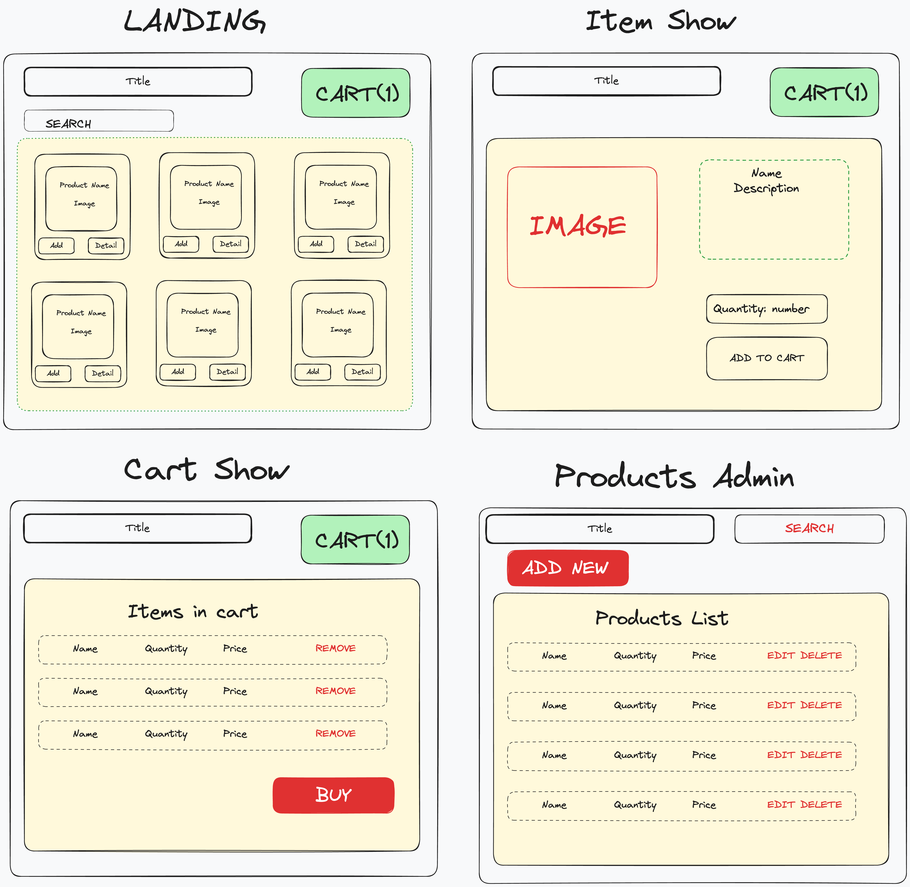
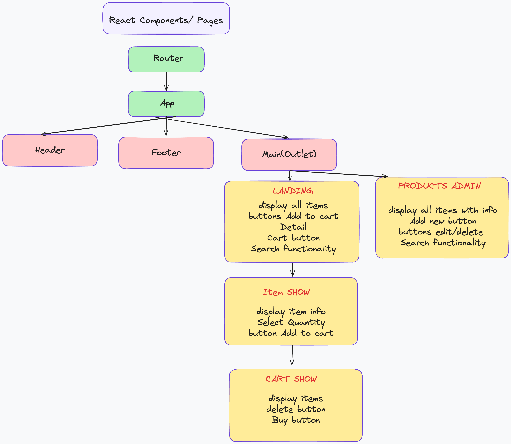

# CAPSTONE PROJECT

# Product Requirements Documentation

- **Developer: Yuliya Buiko**
- - **App Name: E-Commerce App**
- **Description: Back-end for a full-stack e-commerce web application. The system should have an interface to list products for sale, inserting and updating products, adding products to cart, completing purchases, see fulfilment status, it should also offer a method for searching products and tracking inventory.**

- **GitHub Url Front End: https://github.com/uliaarkadz/FE_CAPSTONE.git**
- **Deployed WebSite FE:**

## User Stories

- Users should be able to log in and log out from the app
- Users should be able to see the site on desktop and mobile
- Users can see list of all the products available for sale
- Users can see search in the list of all the products available for sale
- Users can add a new product
- Users can manage products - edit, delete
- Users can see cart and content
- Users can add items to cart
- Users can remove items from cart
- Users can purchase items
- Users can see products inventory

## Design mockups (Desktop + Mobile)

## React Routers

